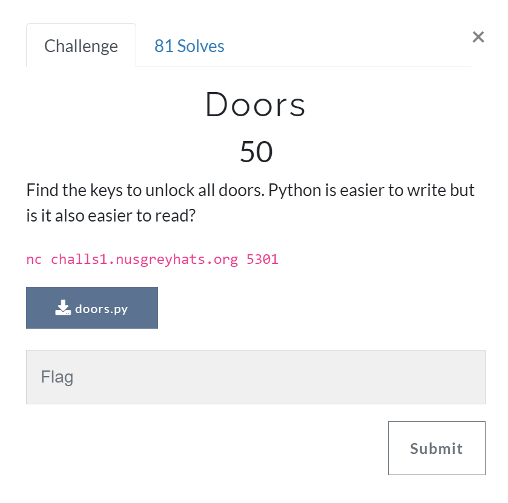

# Doors [Reverse Engineering]

## Prompt
Find the keys to unlock all doors. Python is easier to write but is it also easier to read?

``` bash
nc challs1.nusgreyhats.org 5301
```



## Files
[doors.py](./files/doors.py)

## Description
For this challenge, we first examine the python file provided to us. We notice there were 4 doors to go through before the flag can be outputted, and that failing one of those doors will lead to program termination.

``` python
# driver code
if __name__ == "__main__":
    door1()
    door2()
    door3()
    door4()

    print(flag)
```

The first door requires some bit operation knowledge. Also note that one hex character is 4 bits (e.g. `0x3 = 0011 in binary` and `0x53 = 01010011 in binary`). The first half of the statement shows that the lowest 3 hex characters must be `0x246`, while the second half shows how the upper 12 bits needs to be `0x942`. Combining them both together, we get `0x942246 = 9708102` in decimal.

``` python
# door 1
if (key & 0xfff) == 0x246 and (key >> 12) == 0x942:
    print("Correct!\n")

# key_1 = int('0x942246', 16) = 9708102
```

The second door requires some modulo and floor division operations. we can cuberoot `78402752` to get the lowest 3 digits of the key (due to `key % 1000`), then perform reverse XOR to get the higher digits `861 ^ 189 = 992`. Combine them both together and we have `key_2 = 992428`.

``` python
# door 2
if (key % 1000) ** 3 == 78402752 and ((key // 1000) ^ 861) == 189:
    print("Correct!\n")

# key_2 = 992428
```

The third door requires abit more focus. First thing is that as the seed is constant, we can replicate the shuffle to get the exact pos list arrangement `pos = [6, 0, 3, 4, 5, 1, 2]`. Further examination of the code then shows how it does some mapping of indexes of the `key` to `key_`, which also shows that the key must be 7 digits long. Tracing the mapping yields `key_3 = 2187324`.

``` python 
# door 3
random.seed(52318)
pos = [i for i in range(7)]
random.shuffle(pos)

key_ = 0
for p in pos:
    dg = key % (10 ** (p + 1))
    dg //= 10 ** p
    key -= dg * (10 ** p)
    key_ *= 10
    key_ += dg

if key != 0:
    print("I don't know you. Go away.")
    sys.exit(1)

if key_ == 2478123:
    print("Correct!\n")

# pos  = [6, 0, 3, 4, 5, 1, 2]
# key_ =  2  4  7  8  1  2  3
# rearrange key_ digits according to the numbering in pos
#         4  2  3  7  8  1  2
# then reverse it as the digits are fed from right to left
#         2  1  8  7  3  2  4
# thus, this is our key
# key_3 = 2187324
```

The final door requires some validation with hashing, and for this we brute forced the value out. But notice that `key` is floor divided 6 times, hence the number must be 6 digits, reducing our bruteforce size. The brute force code can be seen [here](./files/door-four-spam.py), where ultimately `key_4 = 612381`.

``` python
# door 4
hhs = [
    b'919c5ab6d04ee9d1c81335692d2ed68e',
    b'9f7e8841c1d64dfde51953fccecde2cf',
    b'bcb34c837111773983f4860ee51cb1b6',
    b'e48b14700f10e3d8f3ad25b73a0d20db',
    b'835f2ff9473cfc787d4f1c08ad5037c9',
    b'c3e3b06937f539a2e52b834a4f1d27fc',
]

import hashlib
import binascii
for i in range(6):
    dg = key % 10
    key //= 10
    hh = binascii.hexlify(hashlib.md5(f"{i}_{dg}_{key}".encode()).digest())

    if hhs[i] != hh:
        print("I don't know you. Go away.")
        sys.exit(1)

if key != 0:
    print("I don't know you. Go away.")
    sys.exit(1)

# brute force, key_4 = 612381
```

With that, we can use the `pwn` library for `python` to run our payload into the remote host. The script we used can be found [here](./files/open-door.py).

``` python
# open-door.py
from pwn import *

HOST = "challs1.nusgreyhats.org"
PORT = 5301

r = remote(HOST, PORT)  
pause()

r.sendline(str(int('0x942246', 16)))    # door 1 9708102
r.sendline("992428")                    # door 2 992428
r.sendline("2187324")                   # door 3 2187324
r.sendline("612381")                    # door 4 612381

r.interactive()
```

Running the python script, we get our flag!

``` bash
$ python3 open_door.py 
[+] Opening connection to challs1.nusgreyhats.org on port 5301: Done
[*] Paused (press any to continue)
[*] Switching to interactive mode
Door 1/4
Enter the passcode:
Correct!

Door 2/4
Enter the passcode:
Correct!

Door 3/4
Enter the passcode:
Correct!

Door 4/4
Enter the passcode:
Correct!

greyhats{0p3n_th3m_w17h_c0d3}
[*] Got EOF while reading in interactive
```

## Flag
`greyhats{0p3n_th3m_w17h_c0d3}`