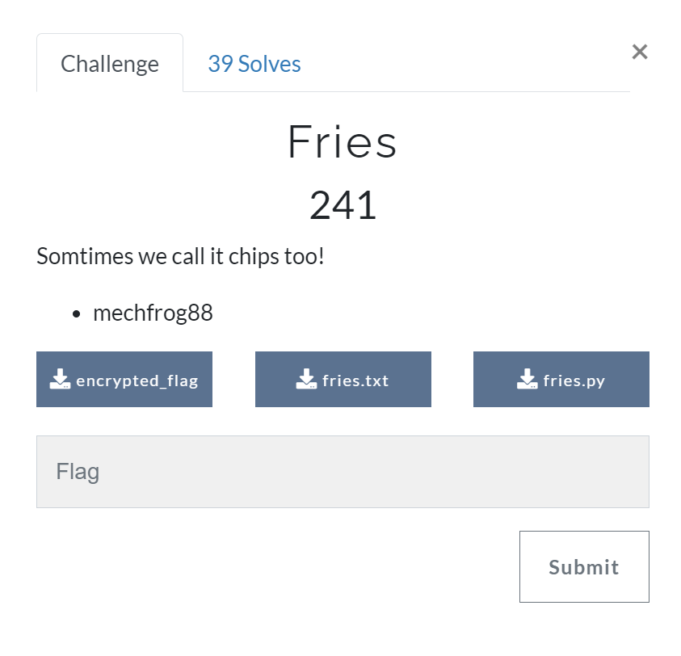

# Fries [Cryptography]

## Prompt 
Sometimes we call it chips too!

[fries.txt](./files/fries.txt)  
[fries.py](./files/fries.py)  
[encrypted_flag](./files/encrypted_flag)



## Description
From the list of scrambled words in fries.txt, it seemed most likely to be a substitution cipher. Feeding the text into a [cipher substitution tool](https://gitlab.com/guballa/SubstitutionBreaker), we get a mapping which we can subsequently use to decode the flag: 

```` python
import hashlib

MAPPING = {"a": "a",
           "l": "b",
           "h": "c",
           "x": "d",
           "g": "e",
           "e": "f",
           "t": "g",
           "s": "h",
           "m": "i",
           "d": "j",
           "v": "k",
           "p": "l",
           "c": "m",
           "i": "n",
           "k": "o",
           "r": "p",
           "f": "q",
           "n": "r",
           "q": "s",
           "b": "t",
           "w": "u",
           "y": "v",
           "z": "w",
           "u": "x",
           "j": "y",
           "o": "z"}

FLAG_CODE = open('encrypted_flag', 'rb').read()

# decrypt based on mapping
def decrypt(word):
    new_word = ""
    for letter in word:
        new_word += MAPPING[letter]
    return new_word

# OTP xor symmetric encryption
# decrypt function same as encrypt function
def encryptFlag(msg, shared_secret):
    sha512 = hashlib.sha512()
    sha512.update(str(shared_secret).encode('ascii'))
    key = sha512.digest()[:len(msg)]
    return bytes([i[0] ^ i[1] for i in zip(key, msg)])

# reverse encrypt due to symmetry
def decryptFlag(msg, shared_secret):
    return encryptFlag(msg, shared_secret)

# driver code
if __name__ == "__main__":
    print("RUNNING DE-FRIER")

    keywords = open('fries.txt', 'r').read().split('\n')[-5:]
    print(keywords)

    keywords_decrypted = list(
        map(lambda word: decrypt(word[:len(word)]), keywords))
    print(keywords_decrypted)

    key = " ".join(keywords_decrypted)
    print(key)

    flag = decryptFlag(FLAG_CODE, key)
    flag = flag.decode("ascii")
    print(flag)

    print("CODE COMPLETED")
    exit(0)
````
[defry.py](./files/defry.py)

## Flag
`greyhats{M@yb3_y0u_c@n_7rY_5paN15h}`