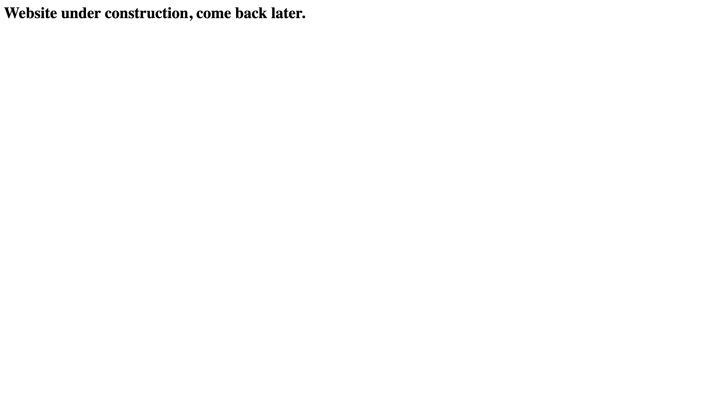
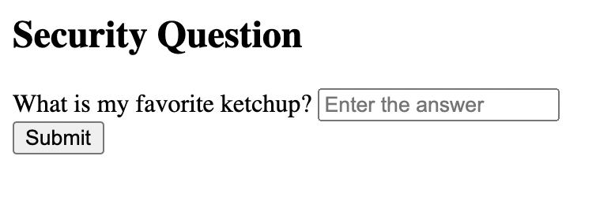

# No ketchup, just sauce (web)

## Statement: 
Building my ketchup startup at http://challs1.nusgreyhats.org:5208/

## Solution: 
Visiting the provided link lead us to the following web page without any interesting leads. 



Checking the robots.txt file, we find the first hint: 
`User-agent: *
Disallow: /reborn.php`

Navigating to the `/reborn.php` endpoint we find the following security question: 



Checking the HTML source file, we see a comment conveniently left by the creator:

`\<!-- Version 2.2.3. Backup file contains version 2.2.2. -->`

We took this as a hint to check for backup files and tested out a few common backup file extensions. We got lucky trying out the .bak extension, which provided us with a downloaded file containing the following: 

````
<html>

<head>
	<title>Ketchup</title>
</head>

<body>
	<!-- Version 2.2.2. -->

	<?php if ($_SERVER['REQUEST_METHOD'] === 'GET') : ?>
		<form action="<?php htmlspecialchars($_SERVER['PHP_SELF']) ?>" method="post">
			<h2>Security Question</h2>
			<div class="form-field">
				<label for="name">What is my favorite ketchup?</label>
				<input type="text" name="ketchup" required="required" placeholder="Enter the answer" />
			</div>

			<div class="form-field">
				<input type="submit" value="Submit" />
			</div>
		</form>
	<?php else : ?>
		<?php
		if (isset($_POST['ketchup'])) {
			$ketchup = htmlspecialchars($_POST['ketchup']);

			if (strcmp($ketchup, 'no ketchup, raw sauce -- too many calories, not good') == 0) {
				echo '<h1>You got it. But nothing to see here for now.</h1>';
			} else {
				echo 'Wrong answer. Go away.';
			}
		} else {
			echo 'You forgot to give an answer. Go back.';
		}
		?>
	<?php endif ?>
</body>

</html>
````

Trying "no ketchup, raw sauce -- too many calories, not good" against the security question worked and we obtained the flag.

greyhats{n0_k3tchup_r4w_s4uc3_892e89h89e}