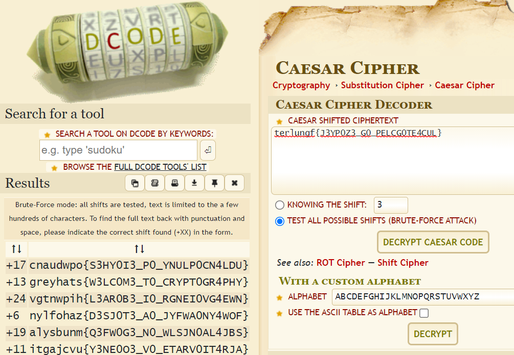

# Pasta [Cryptography]

## Prompt

## Description
Given the message in the prompt as well as the scrambled flag `terlungf{J3YP0Z3_G0_PELCG0TE4CUL}`, the fact that the words 'pasta' and 'rome' are use hints that there is some Caeser cipher going on (or just some simple reshuffle of the alphabet).

For this we used [dCode](https://www.dcode.fr/caesar-cipher)'s Ceasar Cipher Decoder to help.

You can see the different possible outputs churned out, where one of it is our flag!

## Flag
`greyhats{W3LC0M3_T0_CRYPT0GR4PHY}`