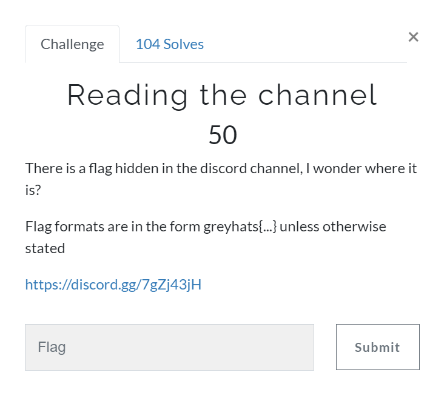
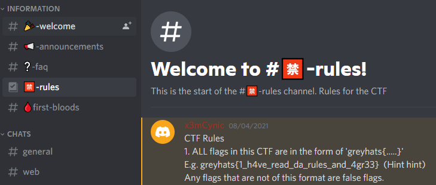

# Reading the channel [Miscellaneous]

## Prompt
There is a flag hidden in the discord channel, I wonder where it is?
Flag formats are in the form greyhats{...} unless otherwise stated.
`https://discord.gg/7gZj43jH`

## Decription
Just a simple challenge to explore both the discord channel. After snooping around, the flag is found on the `🈲-rules` channel.

## Flag
`greyhats{1_h4ve_read_da_rules_and_4gr33}`