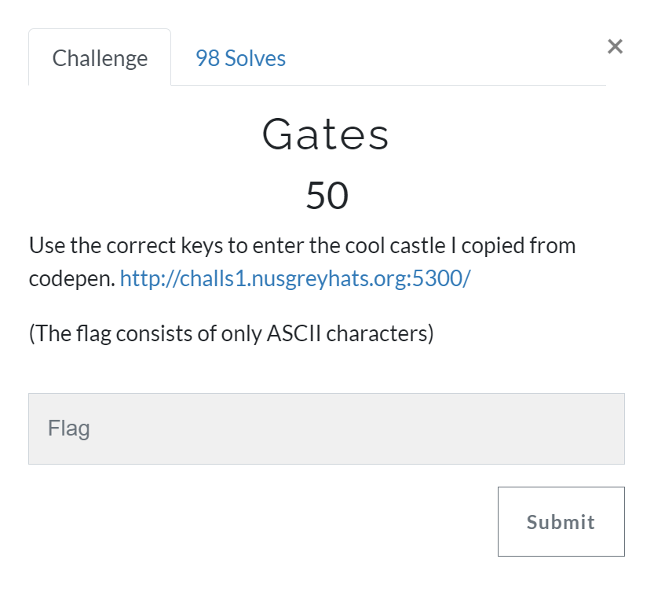
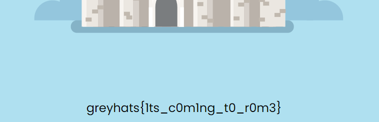

# Gates [Reverse Engineering]

## Prompt
Use the correct keys to enter the cool castle I copied from codepen. `http://challs1.nusgreyhats.org:5300/`

(The flag consists of only ASCII characters)



## Description
Upon loading the site we are greeted with some quiz-styled challenge.


As such, proceeding to explore the soucre code shows us that there is a JavaScript file `gates.js` that can be extracted and examined.

``` html
<!-- extracted from view-source:http://challs1.nusgreyhats.org:5300/ -->
<div id="input-container">
    <label id="input-text">Gate 1</label>
    <input id="input" type="text" name="key" onsubmit="check()"/>
    <p id="result">Correct</p>
</div>

<script src="/gates.js"></script>
```

Upon inspection of [gates.js](./files/gates.js), we see how there are 4 main gates, and each gate is checked with their own specific function.

The first gate is a simple string comparison, hence `key_1 = "1ts"`.

``` js
// extracted from gates.js
var gate1 = (key) => {
    if (key == "1ts") return true;
    return false;
}
```

The second key requires more examination. Observing how it goes, we just need to perform reverse bitwise `XOR` operation to get the respective characters of the 6-character word.

``` js
// extracted from gates.js
var gate2 = (key) => {
    if (key.length != 6)  return false;
    if ((key.charCodeAt(0) ^ "Chicken".charCodeAt(0)) != 0x20) return false;
    if ((key.charCodeAt(1) ^ "Doughnut".charCodeAt(4)) != 0x58) return false;
    if ((key.charCodeAt(2) ^ "Fruit".charCodeAt(3)) != 0x04) return false;
    if ((key.charCodeAt(3) ^ "Icecream".charCodeAt(5)) != 0x54) return false;
    if ((key.charCodeAt(4) ^ "Sausage".charCodeAt(3)) != 0x1d) return false;
    if ((key.charCodeAt(5) ^ "Durian".charCodeAt(4)) != 0x06) return false;
    return true;
}
```

For this a [python script](./files/open-gates.py) was used to help save time, the snippet is below.

``` python
key_2 = ""
key_2 += chr(ord("Chicken"[0]) ^ 0x20)
key_2 += chr(ord("Doughnut"[4]) ^ 0x58)
key_2 += chr(ord("Fruit"[3]) ^ 0x04)
key_2 += chr(ord("Icecream"[5]) ^ 0x54)
key_2 += chr(ord("Sausage"[3]) ^ 0x1d)
key_2 += chr(ord("Durian"[4]) ^ 0x06)
print(key_2) # key_2 = "c0m1ng"
```

The third gate requires a 2 characters, which character ASCII values meet the given statement.

``` js
// extracted from gates.js
var gate3 = (key) => {
    if (key.length != 2) return false;
    var c0 = key.charCodeAt(0);
    var c1 = key.charCodeAt(1);
    if (c0 > c1 && c0 + c1 == 164 && c0 * c1 == 5568) return true;
    return false;
}
```

For this a brute force script is used, which is relatively fast as its 2 characters only. Snippet of the [python file](./files/open-gates.py) is shown below.

``` python
def generate_3():
    for i in range(32, 126): # only valid ascii characters
        for j in range(32, 126):
            if (i > j and i + j == 164  and i * j == 5568):
                return chr(i) + chr(j)
key_3 = generate_3()
print(key_3) # key_3 = "t0"
```

The last gate requires 4 characters, which at this point a brute force is used once more due to its small size.

``` js
// extracted from gates.js
var gate4 = (key) => {
    if (key.length != 4) return false;
    var rs = [2, 3, 4, 5];
    var target = [201, 129, 214, 102];
    for (var i = 0; i < 4; ++i) {
        var r = rs[i];
        var c = key.charCodeAt(i);
        if ((((c << r) & 0xff) | (c >> (8 - r))) != target[i]) return false;
    }
    return true;
}
```

Snippet of the [python file](./files/open-gates.py) is shown below.

``` python
key_4 = ""
def generate_4() :
    key = ""
    rs = [2, 3, 4, 5]
    target = [201, 129, 214, 102]
    for i in range(4):
        for digit in range(33, 126): # only valid ascii characters
            r = rs[i]
            c = digit
            if (((c << r) & 0xff) | (c >> (8 - r))) != target[i]:
                continue
            else:
                key += chr(digit)
                break
    return key
key_4 = generate_4()
print(key_4) # key_4 = "r0m3"
```

With that we have our four keys for the 4 gates.
``` python
key_1 = "1ts"
key_2 = "c0m1ng"
key_3 = "t0"
key_4 = "r0m3"
```

And as such we get our flag!



## Flag
`greyhats{1ts_c0m1ng_t0_r0m3}`