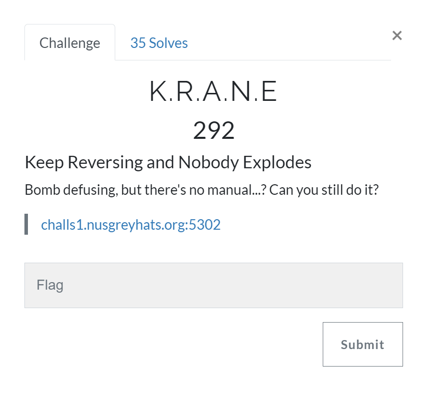
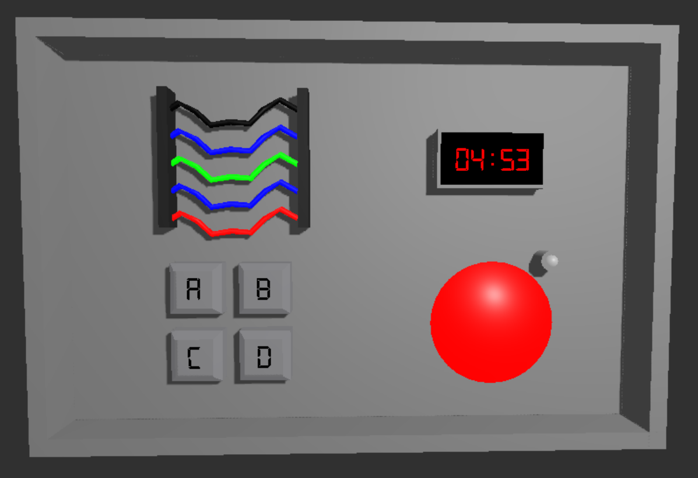
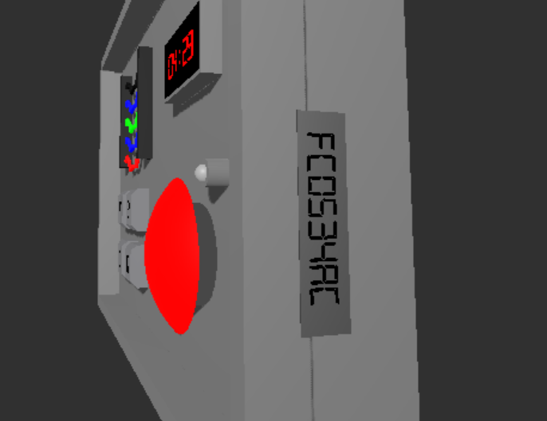
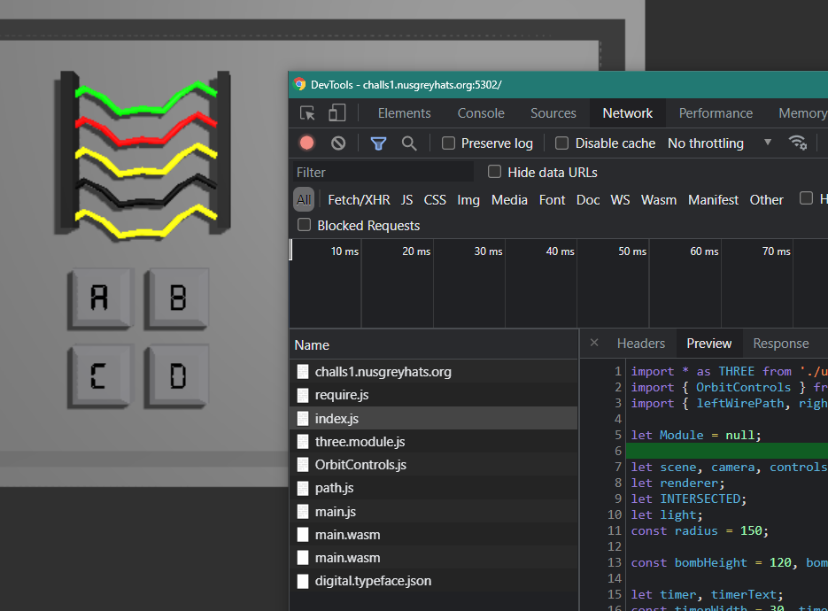
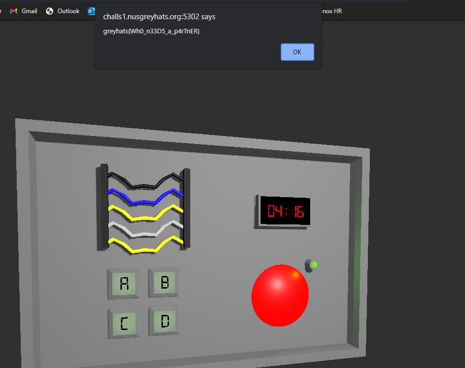
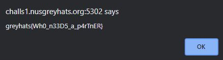

# K.R.A.N.E. [Reverse Engineering]

## Prompt
### Keep Reversing and Nobody Explodes
Bomb defusing, but there's no manual...? Can you still do it?

`challs1.nusgreyhats.org:5302`



## Description
Loading the site brings us to a 3D-interactive bomb defusing simulator. It has some sequence of buttons, some wires and a big red button. It also has a 5-minute timer and a serial code on the right. Everyting except for the timer is seemingly random upon page load.





Before carrying on we extracted the possible code/scripts and examine them. We extracted them using the console/network tab on our browser's developer/inspect tool.



We saw a couple of JavaScript files and also this web assembly file (`.wasm`). The `index.js` and `main.js` calls onto the wasm file to determine if the input combination was correct. We [googled online](https://github.com/wwwg/wasmdec) and saw that there is a decompiler to C code.

``` js
// extracted from index.js
function onPointerClick( event ) {
	if (INTERSECTED == null || !INTERSECTED.selectable) return;

	switch (INTERSECTED.type) {
		case 'wire':
			wires[INTERSECTED.index].cut = true;
			wireObjects[INTERSECTED.index].update = true;
			renderWires();

			const str1 = wires.reduce((arr, el, ind) => (el.cut && arr.push(ind), arr), []).join("");
			const str2 = wires.map(x => x.color).join("");

            // Module.ccall calls on wasm code to determine pass/fail
			Module.ccall("cc", "",
				["string", "number", "string", "number"],
				[str1, str1.length, str2, str2.length]);
			break;
		
		case 'sequence':
			seqBtns[INTERSECTED.index].pressed = true;
			seqBtnObjects[INTERSECTED.index].update = true;
			sequencePressed += String.fromCharCode(65 + INTERSECTED.index);
			renderSequenceBtns();

            // Module.ccall calls on wasm code to determine pass/fail
			Module.ccall("ca", "",
				["string", "number", "number"],
				[sequencePressed, sequencePressed.length, parseInt(serial.substr(2,4), 10)]);
			break;

		case 'condition':
			condBtn.translateY( -condBtnTravelDepth );
			stem.translateY( -condBtnTravelDepth/2 );
			condBtn.selectable = false;
			indicatorLightObj.material.emissive.setHex( 0x00ff00 );
			indicatorLightObj.material.color.set( 0x20ff00 );
			indicatorLight.intensity = 0.8;

            // Module.ccall calls on wasm code to determine pass/fail
			Module.ccall("cb", "",
				["string", "number", "string"],
				[currentTime(), currentTime().length, serial]);
			break;
	
		default:
			break;
	}

    // Module.ccall calls on wasm code to determine pass/fail
	const output = Module.ccall("check", "string", [], []);
	if (output != "") {
		alert(output);
		document.location.reload();
	}
}
```

However, while cloning and setting up the wasm decompiler, one of our `random-button-clicking-to-pass-the-time-session` got through!



And with that, we have the flag (by accident whoops but ain't complaining).



## Flag
`greyhats{Wh0_n33D5_a_p4rTnER}`