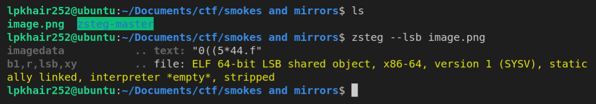
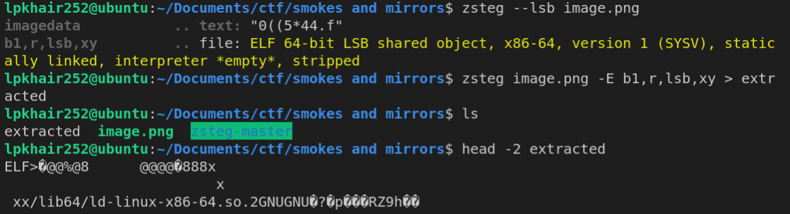
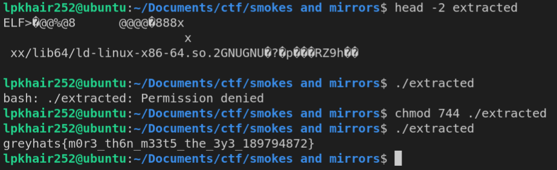

# Smokes and Mirrors [Miscellaneous]

## Prompt
A binary file - flag - has been hidden in image.png via LSB-Steganography! It is known that flag is 11,392 bytes large. Also, the file is spread across the first N pixels of the image when traversing in row-major order.

Can you recover the executable and uncover the flag?

## Files
[image.png](./files/image.png)

## Description
The image provided hides the file using [LSB-Stenography](https://youtu.be/TWEXCYQKyDc) and the bits of the file are spread in a row-major order. 
Before proceeding, please note that the pokemon letter symbols in the image is a red herring.

Following the prompt, we have to extract the binary file from the image provided. For this we use [zsteg](https://github.com/zed-0xff/zsteg) to try and see if we can grab the binary file.

After cloning and installing the tool, we run the zsteg with the `--lsb` flag and we can see that there is a suspicious `ELF` file hidden. 

We then proceed to extract it with the `-E` flag with the right analysis details to grab the binary file.

Finally, running the binary (with the right permissions set) gives us the flag!

## Flag
`greyhats{m0r3_th6n_m33t5_the_3y3_189794872}`