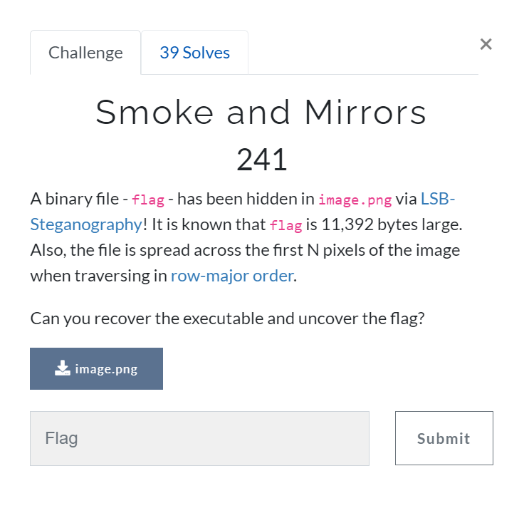

# Smokes and Mirrors [Miscellaneous]

## Prompt
A binary file `-flag-` has been hidden in `image.png` via [LSB-Steganography](https://youtu.be/TWEXCYQKyDc)! It is known that `flag` is 11,392 bytes large. Also, the file is spread across the first N pixels of the image when traversing in [row-major order](https://en.wikipedia.org/wiki/Row-_and_column-major_order).

Can you recover the executable and uncover the flag?



## Files
[image.png](./files/image.png)

## Description
The image provided hides the file using [LSB-Stenography](https://youtu.be/TWEXCYQKyDc) and the bits of the file are spread in a row-major order. 
Before proceeding, please note that the pokemon letter symbols in the image is a red herring.


Following the prompt, we have to extract the binary file from the image provided. For this we use [zsteg](https://github.com/zed-0xff/zsteg) to try and see if we can grab the binary file.

After cloning and installing the tool, we run the zsteg with the `--lsb` flag and we can see that there is a suspicious `ELF` file hidden. 

``` bash
$ ls
image.png  zsteg-master

$ zsteg --lsb image.png
imagedata           .. text: "0((5*44.f"
b1,r,lsb,xy         .. file: ELF 64-bit LSB shared object, x86-64, version 1 (SYSV), statically linked, interpreter *empty*, stripped
```

We then proceed to extract it with the `-E` flag with the right analysis details to grab the binary file.

``` bash
$ zsteg image.png -e b1,r,lsb,xy > extracted

$ ls
extracted  image.png  zsteg-master

$ head -1 extracted 
ELF>�@@%@8 @@@@�888x
                    x
 xx/lib64/ld-linux-x86-64.so.2GNUGNU�?�p���RZ9h��
```

Finally, running the binary gives us the flag!

``` bash
$ ./extracted
greyhats{m0r3_th6n_m33t5_the_3y3_189794872}
```

## Flag
`greyhats{m0r3_th6n_m33t5_the_3y3_189794872}`