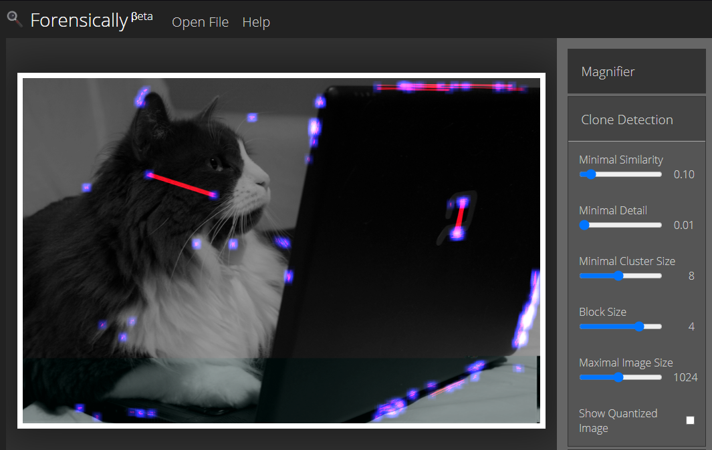
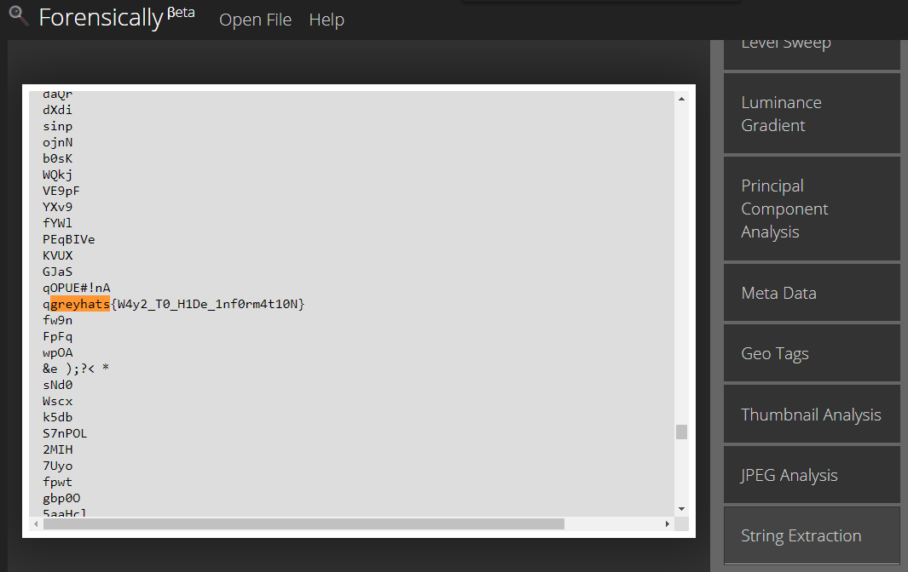
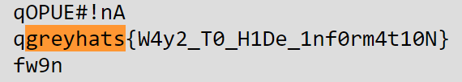

# Strings [Miscellaneous]

## Prompt
What is a string?

[greycat.jpg](./files/greycat.jpg)

## Description
Reading the prompt, we suspect that there is a string fed into the image either as text or as part of the image (due to the discolouration at the bottom).

Hence, we try and load the image with an [online tool](https://29a.ch/photo-forensics/#forensic-magnifier) in order to see what can be extracted from the image.

After exploring with some of the tools present, the flag was found when inspecting the `String Extraction` tab and a simple `CTRL/CMD-F` to search with the keyword `greyhats`.

And we have our flag!

## Flag
`greyhats{W4y2_T0_H1De_1nf0rm4t10N}`