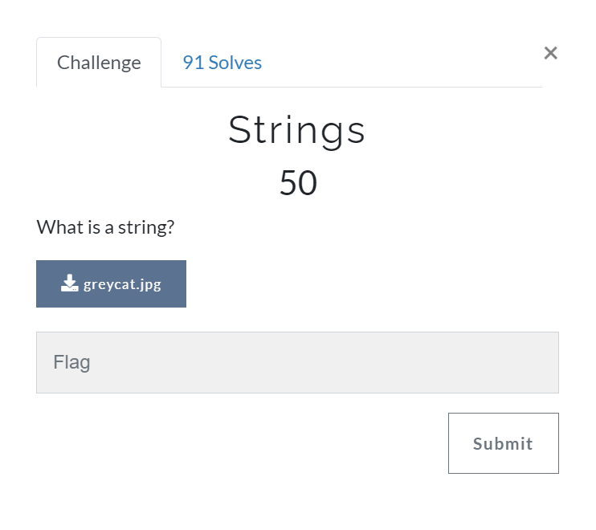

# Strings [Miscellaneous]

## Prompt
What is a string?



## Files
[greycat.jpg](./files/greycat.jpg)

## Description
Reading the prompt, we suspect that there is a string fed into the image either as text or as part of the image (due to the discolouration at the bottom).


We also noticed from the name of the challenge that we might be able to use the `string` command to help filter out strings in a file.

And we have our flag!

``` bash
$ strings greycat.jpg | grep greyhats
qgreyhats{W4y2_T0_H1De_1nf0rm4t10N}

$ strings greycat.jpg | grep greyhats | cut -c 2- # trim random 'q' in strings
greyhats{W4y2_T0_H1De_1nf0rm4t10N}
```

## Flag
`greyhats{W4y2_T0_H1De_1nf0rm4t10N}`