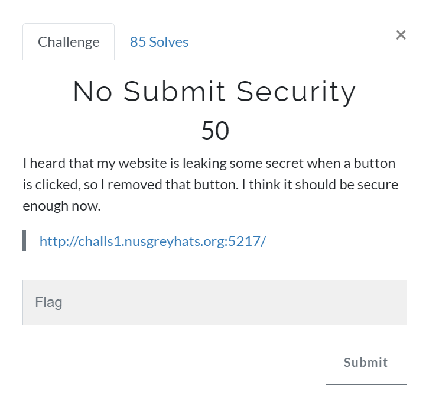
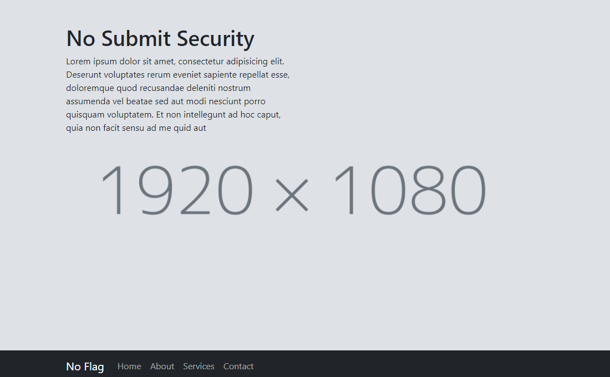
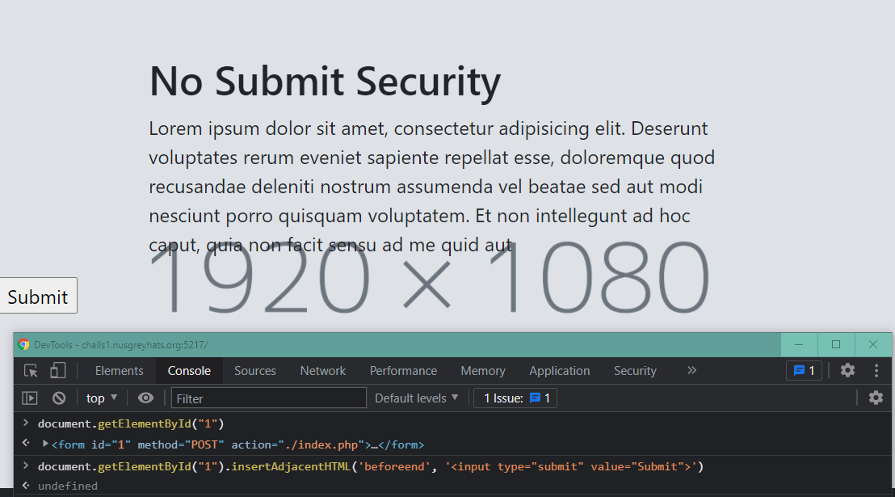
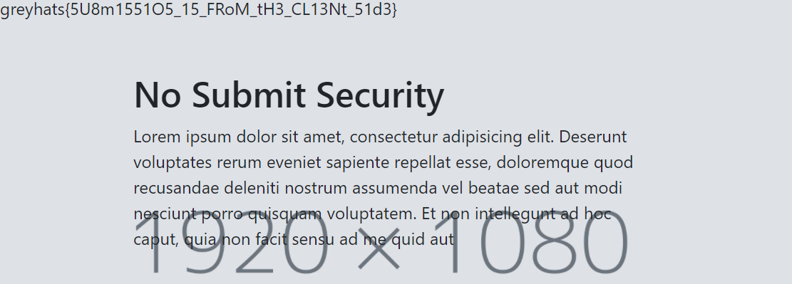

# No Submit Security [Web]

## Prompt
I heard that my website is leaking some secret when a button is clicked, so I removed that button. I think it should be secure enough now.

`http://challs1.nusgreyhats.org:5217/`



## Description
Upon inspecting the site link provided, and inspecting the HTML source code, we can see what the challenge prompt means by `remove that button`.



``` html
<!-- extracted from view-source:http://challs1.nusgreyhats.org:5217/ -->
<form id='1' method="POST" action="./index.php">
    <input type='hidden' name='init' value='1'>
    <input type='hidden' name='tV5MNv7' value='IvuDhsU3PsQ7zy0ob'>
    <!-- rest of form omitted -->
    <input type='hidden' name='r4KKLpw' value='rGI6l6qQDYGcgq6z1'>
</form>
```

Thus, using the browser's console, we can insert some JavaScript code to insert the submit button into the HTML DOM. We used [insertAdjacentHTML](https://developer.mozilla.org/en-US/docs/Web/API/Element/insertAdjacentHTML) function to do this.


``` js
document.getElementById("1");
// <form id=​"1" method=​"POST" action=​"./​index.php">​…​</form>​

document.getElementById("1").insertAdjacentHTML('beforeend', '<input type="submit" value="Submit">');
// undefined
```

We then submit and the flag is revealed to us!


## Flag
`greyhats{5U8m1551O5_15_FRoM_tH3_CL13Nt_51d3}`